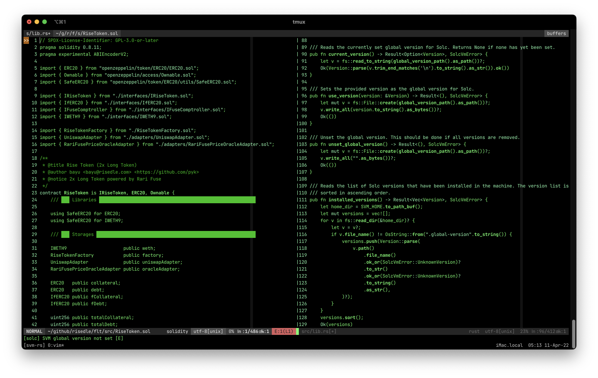

# pyk's vim

This is my vim + tmux setup.

## Vim setup

Remove existing `~/.vim` directory if any.

Clone repo to download all the configurations:

    git clone git@github.com:pyk/vim.git ~/.vim

Run `vim` and install all the plugins via `:PlugInstall`.

### Colors scheme

Enable the colors cheme based on your mood on the `~/.vim/vimrc`.

For example:

    syntax on
    colorscheme green

### Language supports

The following programming languages are supported out of the box:

1. Rust: You need to install `rls` and `rustfmt`.
2. Soldity: You need to install [svm](https://github.com/roynalnaruto/svm-rs).
3. Typescript (.ts and .tsx)

Linting, Autocomplete and Autoformat are supported by [ale](https://github.com/dense-analysis/ale).

## tmux

Install `tmux` via `brew`:

    brew install tmux

Create new file `~/.tmux.conf` then copy paste the following content:

    set -g status on
    set -g status-bg black
    set -g status-fg white
    set -g mouse on

## Extra

- [starship](https://starship.rs/)
- [iTerm](https://iterm2.com/documentation/2.1/index.html) (with minimal theme)
